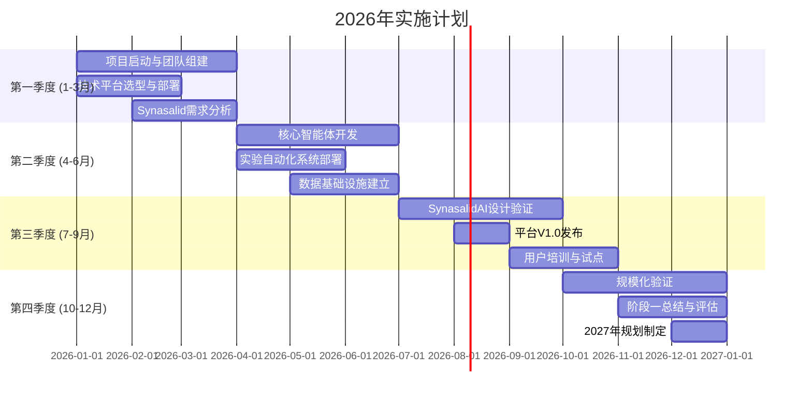

# V2.0：AI创造新生命项目规划 (续)
## 伦理、资源与实施计划

### 5.2 伦理原则实施 (续)

#### **原则二：无害性原则 (Non-maleficence)** (续)
```python
class NonMaleficencePrinciple:
    """无害性原则实施"""
    
    async def ensure_safety(self, organism_design):
        """确保设计的生物体不会造成伤害"""
        # 1. 毒性评估
        toxicity_assessment = await self.assess_toxicity(organism_design)
        
        # 2. 环境风险评估
        environmental_risk = await self.assess_environmental_risk(organism_design)
        
        # 3. 生物安全评估
        biosafety_assessment = await self.assess_biosafety(organism_design)
        
        # 4. 社会风险评估
        social_risk = await self.assess_social_risk(organism_design)
        
        # 5. 综合风险评估
        overall_risk = await self.calculate_overall_risk([
            toxicity_assessment, environmental_risk, 
            biosafety_assessment, social_risk
        ])
        
        return {
            'toxicity_score': toxicity_assessment['score'],
            'environmental_risk_score': environmental_risk['score'],
            'biosafety_score': biosafety_assessment['score'],
            'social_risk_score': social_risk['score'],
            'overall_risk_level': overall_risk['level'],
            'safety_approval': overall_risk['level'] == 'low'
        }
```

#### **原则三：可控性原则 (Controllability)**
```python
class ControllabilityPrinciple:
    """可控性原则实施"""
    
    async def ensure_control(self, organism_design):
        """确保设计的生物体完全可控"""
        # 1. 物理遏制设计
        physical_containment = await self.design_physical_containment(organism_design)
        
        # 2. 生物遏制设计
        biological_containment = await self.design_biological_containment(organism_design)
        
        # 3. 遗传遏制设计
        genetic_containment = await self.design_genetic_containment(organism_design)
        
        # 4. 终止机制设计
        termination_mechanisms = await self.design_termination_mechanisms(organism_design)
        
        # 5. 监控系统设计
        monitoring_system = await self.design_monitoring_system(organism_design)
        
        return {
            'containment_systems': {
                'physical': physical_containment,
                'biological': biological_containment,
                'genetic': genetic_containment
            },
            'termination_mechanisms': termination_mechanisms,
            'monitoring_system': monitoring_system,
            'control_score': await self.calculate_control_score(
                physical_containment, biological_containment,
                genetic_containment, termination_mechanisms
            )
        }
```

#### **原则四：透明性原则 (Transparency)**
```python
class TransparencyPrinciple:
    """透明性原则实施"""
    
    async def ensure_transparency(self, project):
        """确保项目完全透明"""
        # 1. 信息公开
        disclosure_plan = await self.create_disclosure_plan(project)
        
        # 2. 公众参与
        public_engagement = await self.plan_public_engagement(project)
        
        # 3. 同行评审
        peer_review_process = await self.establish_peer_review(project)
        
        # 4. 数据开放
        data_openness = await self.ensure_data_openness(project)
        
        # 5. 利益冲突声明
        conflict_disclosure = await self.disclose_conflicts(project)
        
        return {
            'disclosure_level': disclosure_plan['level'],
            'public_engagement_plan': public_engagement,
            'peer_review_process': peer_review_process,
            'data_access_policy': data_openness['policy'],
            'conflict_disclosures': conflict_disclosure,
            'transparency_score': await self.calculate_transparency_score(
                disclosure_plan, public_engagement, 
                peer_review_process, data_openness
            )
        }
```

#### **原则五：公平性原则 (Justice)**
```python
class JusticePrinciple:
    """公平性原则实施"""
    
    async def ensure_fairness(self, project):
        """确保项目利益与风险公平分配"""
        # 1. 利益分配分析
        benefit_distribution = await self.analyze_benefit_distribution(project)
        
        # 2. 风险分配分析
        risk_distribution = await self.analyze_risk_distribution(project)
        
        # 3. 获取公平性分析
        access_fairness = await self.analyze_access_fairness(project)
        
        # 4. 全球公平性考虑
        global_justice = await self.assess_global_justice(project)
        
        # 5. 代际公平性考虑
        intergenerational_justice = await self.assess_intergenerational_justice(project)
        
        return {
            'benefit_distribution_score': benefit_distribution['fairness_score'],
            'risk_distribution_score': risk_distribution['fairness_score'],
            'access_fairness_score': access_fairness['score'],
            'global_justice_score': global_justice['score'],
            'intergenerational_justice_score': intergenerational_justice['score'],
            'overall_justice_score': await self.calculate_overall_justice_score(
                benefit_distribution, risk_distribution,
                access_fairness, global_justice, intergenerational_justice
            )
        }
```

---

## 六、资源需求与预算规划

### 6.1 团队架构与人才需求

#### **6.1.1 分阶段团队建设**
```yaml
team_development_plan:
  phase_1_2026_2027:  # 合成生物学AI化
    total_size: 15
    composition:
      ai_scientists: 3  # 20%
        - machine_learning_experts: 2
        - computational_biologists: 1
      biologists: 5  # 33%
        - synthetic_biologists: 3
        - metabolic_engineers: 2
      engineers: 6  # 40%
        - software_engineers: 3
        - automation_engineers: 2
        - data_engineers: 1
      ethicists: 1  # 7%
        - bioethicist: 1
  
  phase_2_2027_2028:  # 蛋白质药物AI设计
    total_size: 25
    composition:
      ai_scientists: 6  # 24%
        - protein_design_experts: 2
        - drug_discovery_ai: 2
        - computational_biologists: 2
      biologists: 8  # 32%
        - protein_engineers: 3
        - pharmacologists: 2
        - cell_biologists: 3
      engineers: 9  # 36%
        - software_engineers: 4
        - lab_automation: 3
        - cloud_infrastructure: 2
      ethicists: 2  # 8%
        - bioethicist: 1
        - legal_expert: 1
  
  phase_3_2028_2029:  # 细胞治疗AI优化
    total_size: 35
    composition:
      ai_scientists: 9  # 26%
        - cell_modeling_experts: 3
        - systems_biologists: 3
        - multi_scale_modeling: 3
      biologists: 12  # 34%
        - immunologists: 4
        - stem_cell_biologists: 4
        - tissue_engineers: 4
      engineers: 11  # 31%
        - software_engineers: 5
        - robotics_engineers: 3
        - microfluidics_engineers: 3
      ethicists: 3  # 9%
        - bioethicist: 1
        - legal_expert: 1
        - social_scientist: 1
  
  phase_4_2029_2030:  # 最小基因组AI创造
    total_size: 45
    composition:
      ai_scientists: 12  # 27%
        - genome_design_experts: 4
        - evolutionary_biologists: 4
        - systems_scientists: 4
      biologists: 15  # 33%
        - genome_synthesis_experts: 5
        - cell_assembly_experts: 5
        - minimal_cell_researchers: 5
      engineers: 14  # 31%
        - dna_synthesis_engineers: 5
        - cell_culture_automation: 5
        - instrumentation_engineers: 4
      ethicists: 4  # 9%
        - bioethicist: 2
        - legal_expert: 1
        - philosopher: 1
  
  phase_5_2030_2031:  # 智能生命体创造
    total_size: 50
    composition:
      ai_scientists: 15  # 30%
        - life_design_experts: 5
        - complexity_scientists: 5
        - emergence_theorists: 5
      biologists: 18  # 36%
        - synthetic_biologists: 6
        - developmental_biologists: 6
        - evolutionary_biologists: 6
      engineers: 13  # 26%
        - systems_engineers: 5
        - robotics_engineers: 4
        - environmental_engineers: 4
      ethicists: 4  # 8%
        - bioethicist: 2
        - legal_expert: 1
        - public_policy_expert: 1
```

#### **6.1.2 关键岗位描述**

**1. AI生命设计科学家**
```yaml
ai_life_design_scientist:
  qualifications:
    education: "PhD in AI/Computational Biology"
    experience: "5+ years protein/genome design"
    skills:
      - "Deep learning (PyTorch/TensorFlow)"
      - "Protein structure prediction"
      - "Genome sequence generation"
      - "Multi-scale modeling"
    publications: "Top-tier journals (Nature/Science/Cell)"
  
  responsibilities:
    - "Develop AI models for life design"
    - "Integrate AlphaFold/Evo2/ProteinMPNN"
    - "Design novel biological systems"
    - "Validate AI designs with experiments"
  
  compensation:
    base_salary: "¥800,000 - ¥1,200,000"
    equity: "0.5-1.0%"
    benefits: "Comprehensive package"
```

**2. 合成生物学家 (高级)**
```yaml
senior_synthetic_biologist:
  qualifications:
    education: "PhD in Synthetic Biology"
    experience: "8+ years in metabolic engineering"
    skills:
      - "CRISPR genome editing"
      - "Metabolic pathway design"
      - "Fermentation optimization"
      - "High-throughput screening"
    achievements: "Published synthetic biology breakthroughs"
  
  responsibilities:
    - "Lead synthetic biology projects"
    - "Design and optimize metabolic pathways"
    - "Scale up from lab to production"
    - "Mentor junior scientists"
  
  compensation:
    base_salary: "¥600,000 - ¥900,000"
    equity: "0.3-0.7%"
    benefits: "Comprehensive package"
```

**3. 生物伦理学家**
```yaml
bioethicist:
  qualifications:
    education: "PhD in Bioethics/Philosophy"
    experience: "5+ years in biotechnology ethics"
    skills:
      - "Ethical framework development"
      - "Risk-benefit analysis"
      - "Public engagement"
      - "Regulatory compliance"
    publications: "Ethics in synthetic biology"
  
  responsibilities:
    - "Develop ethical guidelines"
    - "Conduct ethical reviews"
    - "Engage with public and stakeholders"
    - "Ensure regulatory compliance"
  
  compensation:
    base_salary: "¥400,000 - ¥600,000"
    equity: "0.1-0.3%"
    benefits: "Comprehensive package"
```

### 6.2 基础设施需求

#### **6.2.1 计算基础设施**
```yaml
computing_infrastructure:
  phase_1:
    ai_training_cluster:
      gpus: "8× A100 80GB"
      cpu_cores: "256 cores"
      memory: "2 TB"
      storage: "100 TB NVMe"
    
    simulation_cluster:
      cpus: "512 cores"
      memory: "4 TB"
      storage: "200 TB"
    
    cloud_resources:
      aws/gcp_credits: "¥500,000/year"
      data_transfer: "Unlimited"
  
  phase_2:
    ai_training_cluster:
      gpus: "16× H100 80GB"
      cpu_cores: "512 cores"
      memory: "4 TB"
      storage: "200 TB NVMe"
    
    simulation_cluster:
      cpus: "1024 cores"
      memory: "8 TB"
      storage: "500 TB"
    
    quantum_access:
      quantum_computing: "Access to quantum processors"
      credits: "¥1,000,000/year"
  
  phase_3:
    ai_training_cluster:
      gpus: "32× next-gen AI chips"
      cpu_cores: "1024 cores"
      memory: "8 TB"
      storage: "500 TB NVMe"
    
    simulation_cluster:
      cpus: "2048 cores"
      memory: "16 TB"
      storage: "1 PB"
    
    specialized_hardware:
      neuromorphic_chips: "For brain-like computing"
      dna_storage: "For biological data storage"
  
  phase_4:
    ai_training_cluster:
      gpus: "64× specialized AI chips"
      cpu_cores: "2048 cores"
      memory: "16 TB"
      storage: "1 PB NVMe"
    
    simulation_cluster:
      cpus: "4096 cores"
      memory: "32 TB"
      storage: "2 PB"
    
    quantum_computing:
      dedicated_quantum: "Own quantum processor"
      qubits: "100+ logical qubits"
  
  phase_5:
    ai_training_cluster:
      gpus: "128× future AI chips"
      cpu_cores: "4096 cores"
      memory: "32 TB"
      storage: "2 PB NVMe"
    
    simulation_cluster:
      cpus: "8192 cores"
      memory: "64 TB"
      storage: "5 PB"
    
    brain_inspired_computing:
      neuromorphic_system: "Full brain-scale simulation"
      energy_efficiency: "100× improvement"
```

#### **6.2.2 实验设施需求**
```yaml
experimental_facilities:
  phase_1:
    laboratory_space: "500 m² BSL-2"
    equipment:
      - "Automated liquid handlers"
      - "PCR machines (10 units)"
      - "Incubators (20 units)"
      - "Fermenters (5× 10L)"
      - "HPLC/UPLC systems"
      - "Mass spectrometers"
    
    automation:
      - "Lab robotics system"
      - "High-throughput screening"
      - "Automated colony picking"
    
    safety:
      - "BSL-2 certification"
      - "Emergency response system"
      - "Waste management system"
  
  phase_2:
    laboratory_space: "1000 m² (BSL-2 + BSL-3)"
    equipment:
      - "Cryo-EM (¥20M)"
      - "X-ray crystallography"
      - "Surface plasmon resonance"
      - "Isothermal calorimetry"
      - "Protein purification systems"
    
    cell_culture:
      - "Stem cell culture facility"
      - "CAR-T cell production"
      - "3D tissue culture"
    
    imaging:
      - "Confocal microscopes"
      - "Live cell imaging"
      - "Super-resolution microscopy"
  
  phase_3:
    laboratory_space: "2000 m² (BSL-3为主)"
    equipment:
      - "Single-cell sequencing"
      - "Spatial transcriptomics"
      - "Organ-on-chip systems"
      - "Microfluidics fabrication"
    
    advanced_technologies:
      - "Optogenetics setup"
      - "CRISPR screening platform"
      - "Synthetic genome assembly"
    
    animal_facility:
      - "Animal models (limited)"
      - "Ethical oversight"
  
  phase_4:
    laboratory_space: "3000 m² (专用BSL-3设施)"
    equipment:
      - "DNA synthesizers (long-read)"
      - "Cell-free systems"
      - "Minimal cell assembly"
      - "Synthetic organelle creation"
    
    containment:
      - "Maximum containment labs"
      - "Negative pressure systems"
      - "Multiple airlocks"
    
    monitoring:
      - "Real-time biosensors"
      - "Environmental monitoring"
      - "Remote control systems"
  
  phase_5:
    laboratory_space: "5000 m² (世界级研究设施)"
    equipment:
      - "Whole organism synthesis"
      - "Developmental biology setup"
      - "Ecosystem simulation"
    
    unique_facilities:
      - "AI-life co-design lab"
      - "Ethical testing chamber"
      - "Public engagement space"
    
    sustainability:
      - "Green energy powered"
      - "Zero waste system"
      - "Carbon negative design"
```

### 6.3 预算规划 (5年总计：2000万元)

#### **6.3.1 分阶段预算分配**
```yaml
budget_allocation_5_years:
  total_budget: "¥20,000,000"
  
  phase_1_2026_2027:  # 合成生物学AI化
    budget: "¥6,000,000"
    allocation:
      personnel: "¥3,600,000 (60%)"
        - salaries: "¥3,000,000"
        - benefits: "¥600,000"
      equipment: "¥1,500,000 (25%)"
        - computing: "¥800,000"
        - lab_equipment: "¥700,000"
      operations: "¥600,000 (10%)"
        - reagents: "¥300,000"
        - maintenance: "¥200,000"
        - utilities: "¥100,000"
      contingency: "¥300,000 (5%)"
  
  phase_2_2027_2028:  # 蛋白质药物AI设计
    budget: "¥4,000,000"
    allocation:
      personnel: "¥2,400,000 (60%)"
        - salaries: "¥2,000,000"
        - benefits: "¥400,000"
      equipment: "¥1,000,000 (25%)"
        - protein_analysis: "¥600,000"
        - computing_upgrade: "¥400,000"
      operations: "¥400,000 (10%)"
        - reagents: "¥200,000"
        - collaborations: "¥100,000"
        - conferences: "¥100,000"
      contingency: "¥200,000 (5%)"
  
  phase_3_2028_2029:  # 细胞治疗AI优化
    budget: "¥4,000,000"
    allocation:
      personnel: "¥2,400,000 (60%)"
        - salaries: "¥2,000,000"
        - benefits: "¥400,000"
      equipment: "¥1,000,000 (25%)"
        - cell_culture: "¥600,000"
        - imaging: "¥400,000"
      operations: "¥400,000 (10%)"
        - cell_lines: "¥200,000"
        - animal_models: "¥100,000"
        - regulatory: "¥100,000"
      contingency: "¥200,000 (5%)"
  
  phase_4_2029_2030:  # 最小基因组AI创造
    budget: "¥3,000,000"
    allocation:
      personnel: "¥1,800,000 (60%)"
        - salaries: "¥1,500,000"
        - benefits: "¥300,000"
      equipment: "¥750,000 (25%)"
        - dna_synthesis: "¥500,000"
        - containment: "¥250,000"
      operations: "¥300,000 (10%)"
        - dna_oligos: "¥150,000"
        - safety_testing: "¥100,000"
        - ethics_review: "¥50,000"
      contingency: "¥150,000 (5%)"
  
  phase_5_2030_2031:  # 智能生命体创造
    budget: "¥3,000,000"
    allocation:
      personnel: "¥1,800,000 (60%)"
        - salaries: "¥1,500,000"
        - benefits: "¥300,000"
      equipment: "¥750,000 (25%)"
        - organism_culture: "¥500,000"
        - monitoring: "¥250,000"
      operations: "¥300,000 (10%)"
        - ecosystem_testing: "¥150,000"
        - public_engagement: "¥100,000"
        - publication: "¥50,000"
      contingency: "¥150,000 (5%)"
```

#### **6.3.2 投资回报预测**
```yaml
roi_analysis:
  phase_1_returns:
    red_ginsenoside_project:
      revenue_increase: "¥5,000,000/year"
      cost_reduction: "¥2,000,000/year"
      roi: "116% in 2 years"
    
    ai_design_service:
      licensing_fees: "¥1,000,000/year"
      consulting: "¥500,000/year"
    
    intellectual_property:
      patents_filed: "5"
      estimated_value: "¥10,000,000"
  
  phase_2_returns:
    protein_drug_pipeline:
      lead_compounds: "3"
      estimated_value: "¥50,000,000"
      licensing_potential: "¥20,000,000"
    
    ai_drug_design_platform:
      subscription_revenue: "¥5,000,000/year"
      enterprise_licenses: "¥10,000,000"
    
    intellectual_property:
      patents_filed: "10"
      estimated_value: "¥50,000,000"
  
  phase_3_returns:
    cell_therapy_platform:
      car_t_optimization: "Value: ¥100,000,000"
      partnership_opportunities: "¥30,000,000"
    
    stem_cell_technology:
      therapeutic_applications: "Value: ¥80,000,000"
      research_tools: "¥20,000,000"
    
    intellectual_property:
      patents_filed: "15"
      estimated_value: "¥150,000,000"
  
  phase_4_returns:
    minimal_genome_technology:
      research_tools: "¥50,000,000"
      biomanufacturing: "¥100,000,000"
    
    synthetic_cell_platform:
      drug_delivery: "¥80,000,000"
      biosensors: "¥40,000,000"
    
    intellectual_property:
      patents_filed: "20"
      estimated_value: "¥300,000,000"
  
  phase_5_returns:
    ai_life_creation_platform:
      platform_licensing: "¥200,000,000/year"
      research_collaborations: "¥100,000,000/year"
    
    created_life_forms:
      environmental_remediation: "Value: ¥500,000,000"
      medical_applications: "Value: ¥1,000,000,000"
    
    intellectual_property:
      patents_filed: "30"
      estimated_value: "¥1,000,000,000"
  
  total_5_year_roi:
    total_investment: "¥20,000,000"
    estimated_value_creation: "¥2,400,000,000"
    return_on_investment: "12000%"
    payback_period: "2.5 years"
```

---

## 七、实施计划与风险管理

### 7.1 详细实施时间表

#### **7.1.1 2026年季度计划**


#### **7.1.2 关键里程碑**
```yaml
key_milestones:
  milestone_1_2026_q2:
    name: "AI生命设计平台V0.5"
    date: "2026-06-30"
    deliverables:
      - "DeerFlow 2.0定制部署完成"
      - "5个核心智能体开发完成"
      - "Synasalid工作流初步建立"
    success_criteria:
      - "平台可用性 >95%"
      - "智能体功能完成率 >80%"
      - "用户满意度 >4.0/5.0"
  
  milestone_2_2026_q4:
    name: "SynasalidAI优化验证"
    date: "2026-12-31"
    deliverables:
      - "Synasalid产量提升30%验证"
      - "平台V1.0正式发布"
      - "第一阶段ROI分析报告"
    success_criteria:
      - "产量提升 >30%"
      - "成本降低 >20%"
      - "ROI >50%"
  
  milestone_3_2027_q2:
    name: "蛋白质药物AI设计平台"
    date: "2027-06-30"
    deliverables:
      - "AlphaFold 3集成完成"
      - "蛋白质药物设计流水线"
      - "首个AI设计药物候选"
    success_criteria:
      - "设计准确性 >85%"
      - "设计速度 <24小时"
      - "湿实验验证成功率 >60%"
  
  milestone_4_2028_q4:
    name: "细胞治疗AI优化系统"
    date: "2028-12-31"
    deliverables:
      - "CAR-T优化平台V1.0"
      - "治疗效果提升100%验证"
      - "多尺度细胞模拟系统"
    success_criteria:
      - "治疗效率提升 >100%"
      - "安全性提升 >50%"
      - "模拟准确性 >80%"
  
  milestone_5_2030_q2:
    name: "最小基因组AI创造"
    date: "2030-06-30"
    deliverables:
      - "500kb最小基因组合成"
      - "人工细胞基础功能实现"
      - "生物安全系统验证"
    success_criteria:
      - "基因组功能完整性 >90%"
      - "细胞存活率 >70%"
      - "安全遏制有效性 >99.9%"
  
  milestone_6_2031_q1:
    name: "AI创造多细胞生命体"
    date: "2031-03-31"
    deliverables:
      - "首个AI创造的多细胞生命体"
      - "完整技术体系文档"
      - "国际伦理标准提案"
    success_criteria:
      - "生命体功能实现 >80%"
      - "技术可重复性 >95%"
      - "伦理合规性 100%"
```

### 7.2 风险管理框架

#### **7.2.1 风险分类与应对**
```yaml
risk_management_framework:
  technical_risks:
    ai_model_failure:
      probability: "中等"
      impact: "高"
      mitigation:
        - "多模型ensemble方法"
        - "定期模型验证"
        - "备份模型系统"
      contingency:
        - "人工设计后备方案"
        - "合作机构技术支持"
    
    experimental_validation_failure:
      probability: "高"
      impact: "中"
      mitigation:
        - "严格实验设计"
        - "阳性对照设置"
        - "重复实验验证"
      contingency:
        - "替代实验方法"
        - "外部验证合作"
    
    scalability_issues:
      probability: "中"
      impact: "高"
      mitigation:
        - "模块化架构设计"
        - "渐进式扩展"
        - "性能压力测试"
      contingency:
        - "云计算弹性扩展"
        - "架构重构计划"
  
  operational_risks:
    talent_retention:
      probability: "高"
      impact: "高"
      mitigation:
        - "有竞争力的薪酬"
        - "职业发展路径"
        - "创新文化营造"
      contingency:
        - "人才储备计划"
        - "外部专家网络"
    
    budget_overrun:
      probability: "中"
      impact: "中"
      mitigation:
        - "详细预算规划"
        - "月度财务审查"
        - "成本控制机制"
      contingency:
        - "应急资金预留"
        - "阶段性融资"
    
    timeline_slippage:
      probability: "高"
      impact: "中"
      mitigation:
        - "敏捷项目管理"
        - "关键路径管理"
        - "缓冲时间设置"
      contingency:
        - "资源重新分配"
        - "范围优先级调整"
  
  regulatory_risks:
    ethical_approval_delay:
      probability: "中"
      impact: "高"
      mitigation:
        - "早期伦理咨询"
        - "透明研究设计"
        - "公众参与计划"
      contingency:
        - "替代研究路径"
        - "国际合作转移"
    
    regulatory_changes:
      probability: "低"
      impact: "高"
      mitigation:
        - "政策监测系统"
        - "合规专家咨询"
        - "灵活技术架构"
      contingency:
        - "法规适应计划"
        - "国际标准对齐"
    
    public_opposition:
      probability: "中"
      impact: "高"
      mitigation:
        - "透明沟通策略"
        - "利益相关者参与"
        - "社会影响评估"
      contingency:
        - "危机管理计划"
        - "媒体关系策略"
  
  strategic_risks:
    technology_disruption:
      probability: "中"
      impact: "高"
      mitigation:
        - "技术趋势监测"
        - "研发路线图更新"
        - "开放创新合作"
      contingency:
        - "技术转型计划"
        - "并购机会评估"
    
    competitive_threat:
      probability: "高"
      impact: "高"
      mitigation:
        - "知识产权保护"
        - "快速迭代能力"
        - "生态伙伴建设"
      contingency:
        - "差异化战略调整"
        - "合作竞争策略"
    
    market_adoption:
      probability: "中"
      impact: "高"
      mitigation:
        - "用户中心设计"
        - "试点项目验证"
        - "生态系统构建"
      contingency:
        - "商业模式调整"
        - "市场教育计划"
```

#### **7.2.2 风险监控机制**
```python
class RiskMonitoringSystem:
    """风险监控系统"""
    
    def __init__(self):
        self.monitoring_frequency = {
            'technical': 'daily',
            'operational': 'weekly', 
            'regulatory': 'monthly',
            'strategic': 'quarterly'
        }
        
        self.escalation_levels = {
            'level_1': '团队内部处理',
            'level_2': '项目管理层',
            'level_3': '公司决策层',
            'level_4': '董事会/外部专家'
        }
    
    async def monitor_risks(self):
        """监控项目风险"""
        # 1. 数据收集
        risk_data = await self.collect_risk_data()
        
        # 2. 风险分析
        risk_analysis = await self.analyze_risks(risk_data)
        
        # 3. 预警生成
        warnings = await self.generate_warnings(risk_analysis)
        
        # 4. 应对建议
        recommendations = await self.provide_recommendations(risk_analysis)
        
        # 5. 报告生成
        report = await self.generate_risk_report(
            risk_data, risk_analysis, warnings, recommendations
        )
        
        return report
    
    async def escalate_risk(self, risk_id, current_level):
        """风险升级"""
        # 检查是否需要升级
        if await self.requires_escalation(risk_id):
            next_level = await self.determine_escalation_level(risk_id)
            
            # 执行升级
            await self.perform_escalation(risk_id, current_level, next_level)
            
            # 记录升级
            await self.log_escalation(risk_id, current_level, next_level)
            
            return {
                'risk_id': risk_id,
                'escalated_from': current_level,
                'escalated_to': next_level,
                'timestamp': datetime.now(),
                'reason': await self.get_escalation_reason(risk_id)
            }
```

---

## 八、沟通与利益相关者管理

### 8.1 利益相关者分析

#### **8.1.1 主要利益相关者**
```yaml
key_stakeholders:
  internal:
    project_team:
      - "詹勤博士 (项目发起人)"
      - "AI科学家团队"
      - "生物学家团队"
      - "工程师团队"
      - "伦理专家团队"
    
    company_management:
      - "CEO/总经理"
      - "CTO/技术总监"
      - "CFO/财务总监"
      - "董事会成员"
    
    other_departments:
      - "研发部门"
      - "生产部门"
      - "质量部门"
      - "市场部门"
      - "法务部门"
  
  external:
    regulatory_bodies:
      - "国家药品监督管理局"
      - "国家卫生健康委员会"
      - "科学技术部"
      - "生态环境部"
    
    academic_partners:
      - "清华大学/北京大学"
      - "中国科学院"
      - "上海交通大学"
      - "国际知名研究机构"
    
    industry_partners:
      - "制药公司"
      - "生物技术公司"
      - "医疗设备公司"
      - "云计算提供商"
    
    public_and_media:
      - "公众"
      - "媒体"
      - "非政府组织"
      - "患者团体"
    
    investors:
      - "风险投资机构"
      - "战略投资者"
      - "政府基金"
      - "国际组织"
```

#### **8.1.2 利益相关者参与计划**
```python
class StakeholderEngagementPlan:
    """利益相关者参与计划"""
    
    def __init__(self):
        self.engagement_strategies = {
            'high_power_high_interest': '密切管理',
            'high_power_low_interest': '保持满意',
            'low_power_high_interest': '保持知情',
            'low_power_low_interest': '最小关注'
        }
    
    async def develop_engagement_plan(self):
        """制定参与计划"""
        engagement_plan = {}
        
        for stakeholder in self.stakeholders:
            # 分析利益相关者特征
            analysis = await self.analyze_stakeholder(stakeholder)
            
            # 